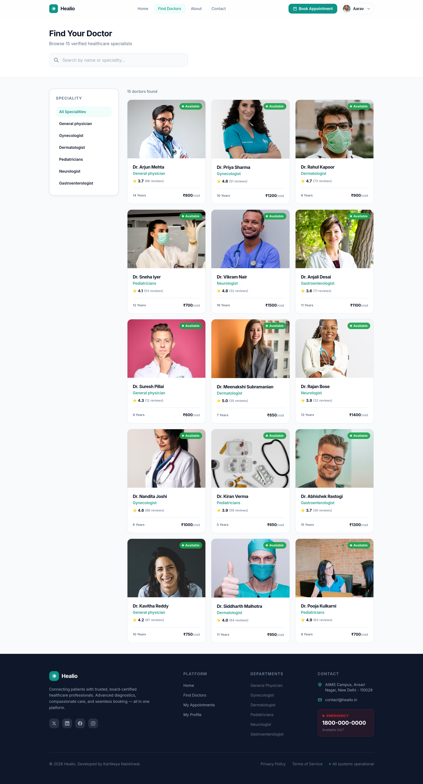
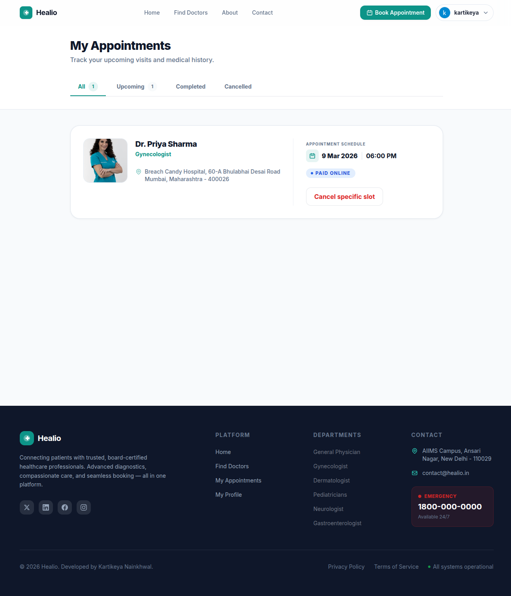
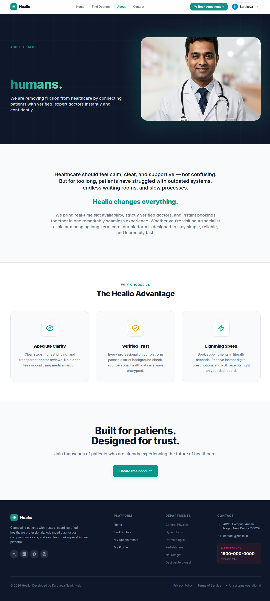
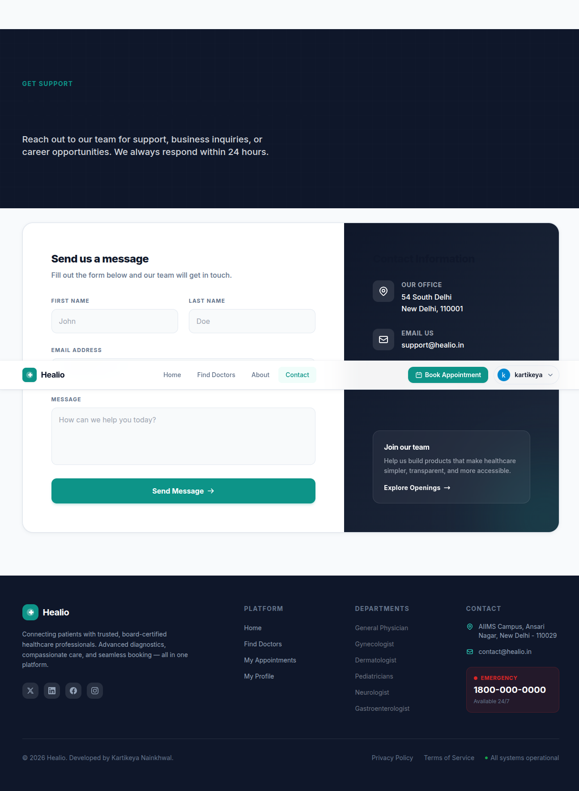
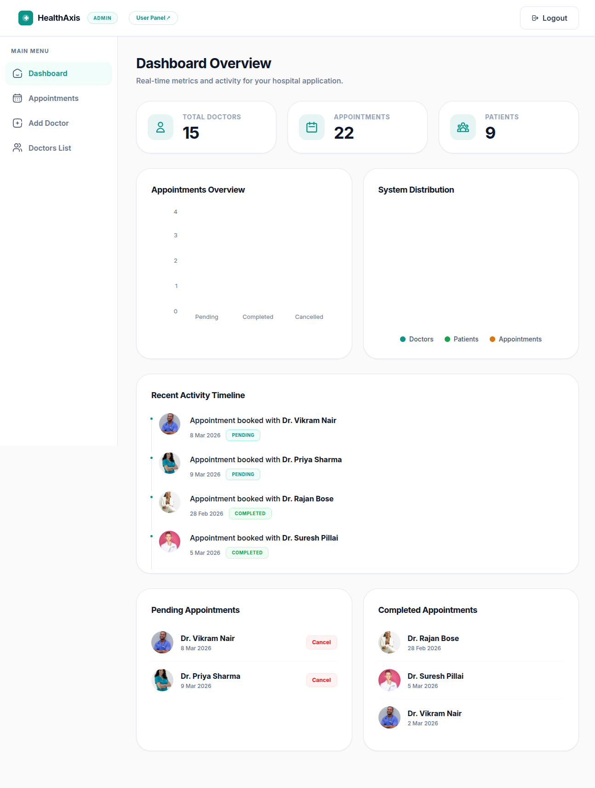
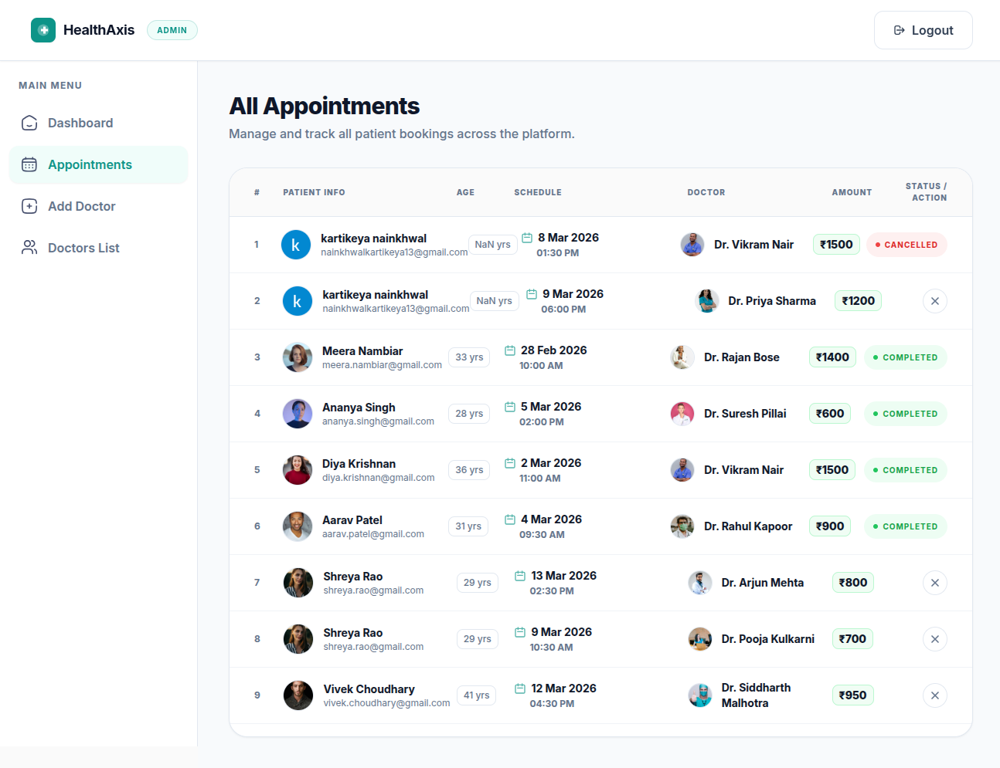
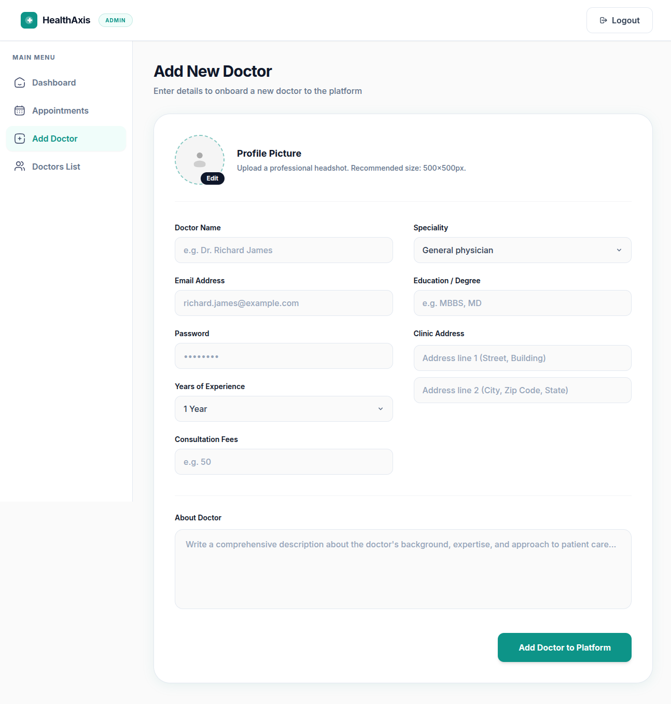
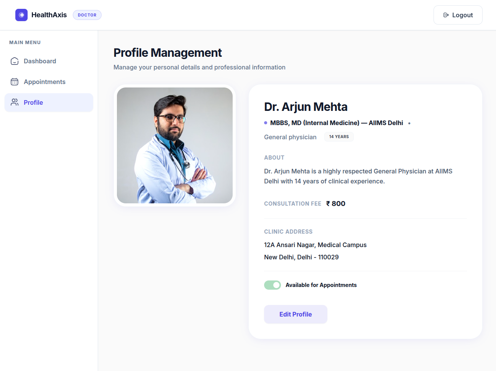
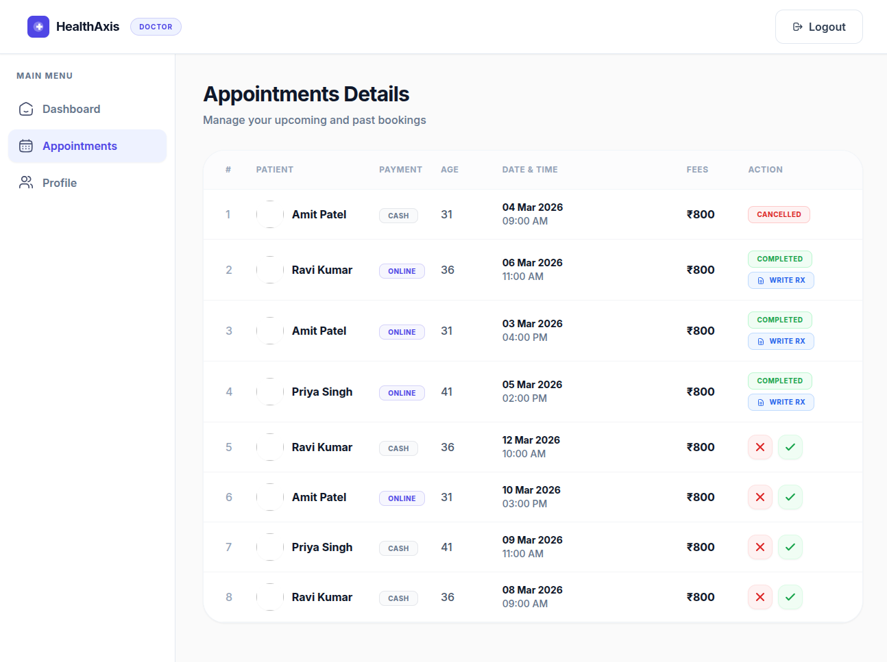

<div align="center">


<br/>

# 🏥 Healio

### Advanced Healthcare You Can Trust

> A production-grade healthcare platform that connects **patients, doctors, and administrators** in one seamless digital ecosystem — with real-time booking, secure payments, and digital prescriptions.

⚡ **Built by [Kartikeya Nainkhwal](mailto:kartikeyanainkhwal@gmail.com) — Full Stack Developer specializing in scalable SaaS platforms.**

<br/>

[]()
[]()
[]()
[]()
[]()
[]()

<br/>

📂 **Repository:** [GitHub](https://github.com/KartikeyaNainkhwal/HealthAxis)

</div>

---

## ✨ Overview

**Healio** is a full-stack MERN healthcare platform designed to replicate real-world hospital and clinic systems. It provides three dedicated portals — **Patient**, **Doctor**, and **Admin** — each with tailored dashboards, workflows, and analytics.

**Patients** can discover doctors, book appointments with real-time slot validation, pay securely via Razorpay, and receive digital prescriptions. **Doctors** get a dedicated dashboard to manage appointments, write prescriptions, and track revenue. **Admins** have full control over the platform — managing doctors, monitoring appointments, and viewing system-wide analytics.

---

## 📸 Screenshots

### 🌐 Patient Portal

<details>
<summary><strong>Home Page</strong></summary>


</details>

<details>
<summary><strong>Find Doctors</strong></summary>



</details>

<details>
<summary><strong>Appointment Booking</strong></summary>


</details>

<details>
<summary><strong>My Appointments</strong></summary>



</details>

<details>
<summary><strong>My Profile</strong></summary>


</details>

<details>
<summary><strong>About Page</strong></summary>



</details>

<details>
<summary><strong>Contact Page</strong></summary>



</details>

---

### 🛡️ Admin Panel

<details>
<summary><strong>Admin Login</strong></summary>


</details>

<details>
<summary><strong>Admin Dashboard</strong></summary>



</details>

<details>
<summary><strong>All Appointments</strong></summary>



</details>

<details>
<summary><strong>Add Doctor</strong></summary>



</details>

<details>
<summary><strong>Doctors Catalog</strong></summary>


</details>

---

### 🩺 Doctor Portal

<details>
<summary><strong>Doctor Dashboard</strong></summary>


</details>

<details>
<summary><strong>Doctor Profile Management</strong></summary>



</details>

<details>
<summary><strong>Doctor Profile Management</strong></summary>



</details>

---

## 🧩 Features

### 👤 Patient Portal

- Search doctors by **speciality, name, and availability**
- Book appointments with **real-time slot validation**
- Secure payments via **Razorpay** with automated refund logic
- View appointment history and download **digital prescriptions (PDF)**
- Leave **verified doctor reviews** (1–5 star ratings)
- Email **OTP verification** and **Google OAuth** login
- Full profile management with appointment cancellation

### 👨‍⚕️ Doctor Dashboard

- View and manage upcoming appointments
- Accept or cancel patient bookings
- Write and issue **digital prescriptions**
- Track **revenue trends**, total patients, and appointment stats
- Manage profile details and toggle availability

### 🛡️ Admin Panel

- Add, edit, or remove doctors from the platform
- View all users, doctors, and appointments
- Monitor **system-wide analytics** — appointments, revenue, patient counts
- Manage payments and process refunds
- Full **role-based access control**

---

## 💳 Payment System

Healio integrates **Razorpay** for secure payment processing with automated refund logic:

| Time Before Appointment | Refund        |
|-------------------------|---------------|
| More than 24 hours      | ✅ 100% Refund |
| 12 – 24 hours           | ⚠️ 50% Refund  |
| Less than 12 hours      | ❌ No Refund    |

---

## ⭐ Reviews System

After a completed appointment, patients receive a **review request email**. They can leave a 1–5 star rating with comments, which appear on the doctor's public profile — creating real **social proof and trust**.

---

## 📩 Notifications

- **Email** — Booking confirmations, appointment reminders, review requests (Nodemailer)
- **WhatsApp** — Appointment notifications (Twilio)

---

## 🔐 Security

- JWT-based authentication with role-based access control
- Password hashing with **bcrypt**
- Protected API routes for all three portals
- Secure payment verification via Razorpay signatures

---

## 🛠 Tech Stack

| Layer          | Technologies                                        |
|----------------|-----------------------------------------------------|
| **Frontend**   | React, Vite, TailwindCSS, Framer Motion, React Router |
| **Backend**    | Node.js, Express, MongoDB, Mongoose                 |
| **Auth**       | JWT, bcrypt, Google OAuth                            |
| **Payments**   | Razorpay                                             |
| **Storage**    | Cloudinary                                           |
| **Email**      | Nodemailer                                           |
| **WhatsApp**   | Twilio                                               |
| **Charts**     | Recharts                                             |
| **Deployment** | Vercel / Render                                      |

---

## 📂 Project Structure

```
Healio/
├── frontend/          # Patient-facing React app (port 5173)
│   ├── src/
│   │   ├── components/
│   │   ├── pages/
│   │   └── context/
│   └── ...
│
├── admin/             # Admin + Doctor panel React app (port 5174)
│   ├── src/
│   │   ├── components/
│   │   ├── pages/
│   │   │   ├── Admin/
│   │   │   └── Doctor/
│   │   └── context/
│   └── ...
│
├── backend/           # Express API server (port 4000)
│   ├── controllers/
│   ├── models/
│   ├── routes/
│   ├── middlewares/
│   └── ...
│
└── screenshots/       # Application screenshots
```

---

## 🚀 Getting Started

### Prerequisites

- Node.js (v18+)
- MongoDB (local or Atlas)
- Razorpay account (for payments)
- Cloudinary account (for file uploads)

### 1. Clone the repository

```bash
git clone https://github.com/KartikeyaNainkhwal/HealthAxis.git
cd HealthAxis
```

### 2. Backend setup

```bash
cd backend
npm install
```

Create a `.env` file:

```env
MONGODB_URI=
JWT_SECRET=

ADMIN_EMAIL=
ADMIN_PASSWORD=

CLOUDINARY_NAME=
CLOUDINARY_API_KEY=
CLOUDINARY_SECRET_KEY=

RAZORPAY_KEY_ID=
RAZORPAY_KEY_SECRET=

EMAIL_FROM=
SMTP_USER=
SMTP_PASS=

GOOGLE_CLIENT_ID=
```

Start the server:

```bash
npm run server
```

### 3. Frontend setup

```bash
cd frontend
npm install
npm run dev
```

### 4. Admin panel setup

```bash
cd admin
npm install
npm run dev
```

### Local URLs

| Service         | URL                     |
|-----------------|-------------------------|
| Patient Website | http://localhost:5173    |
| Admin Panel     | http://localhost:5174    |
| Backend API     | http://localhost:4000    |

---

## 💼 Business Use Cases

Healio's architecture can power:

- Private clinics and multi-doctor hospitals
- Telemedicine and healthcare startups
- Medical appointment marketplaces
- Salon / hotel / consulting booking systems
- Any service-provider SaaS platform

---

## 🧠 Problems Solved

| Problem                          | Healio's Solution              |
|----------------------------------|--------------------------------|
| Appointment double-booking       | Real-time slot validation      |
| Poor admin visibility            | Role-based analytics dashboard |
| No doctor performance tracking   | Revenue & appointment trends   |
| Complex payment handling         | Automated Razorpay + refunds   |
| No patient trust signals         | Verified review system         |

---

## 🤝 Open for Work

I specialize in building **full-stack SaaS platforms** and **modern web applications**.

- Full-stack MERN development
- Startup MVP development
- Dashboard & analytics systems
- Payment integrations
- API design & development

📩 **Email:** [kartikeyanainkhwal@gmail.com](mailto:kartikeyanainkhwal@gmail.com)

---

<div align="center">

⭐ **Star this repo** if you found it useful!

Built with ❤️ by **Kartikeya Nainkhwal**

</div>
