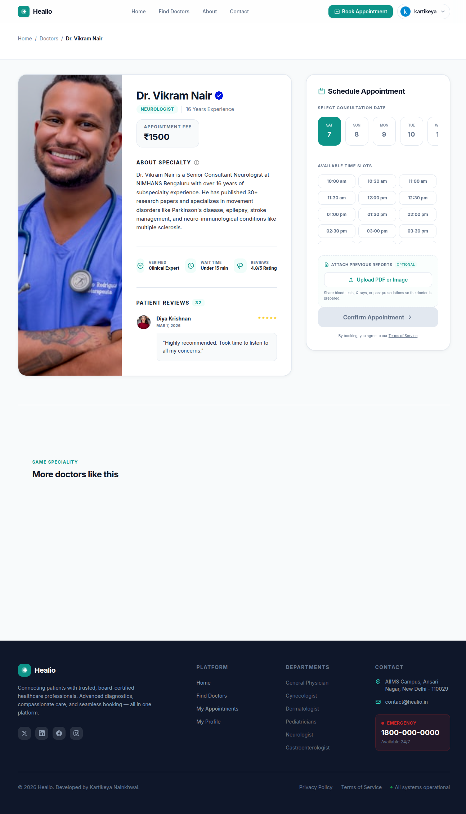
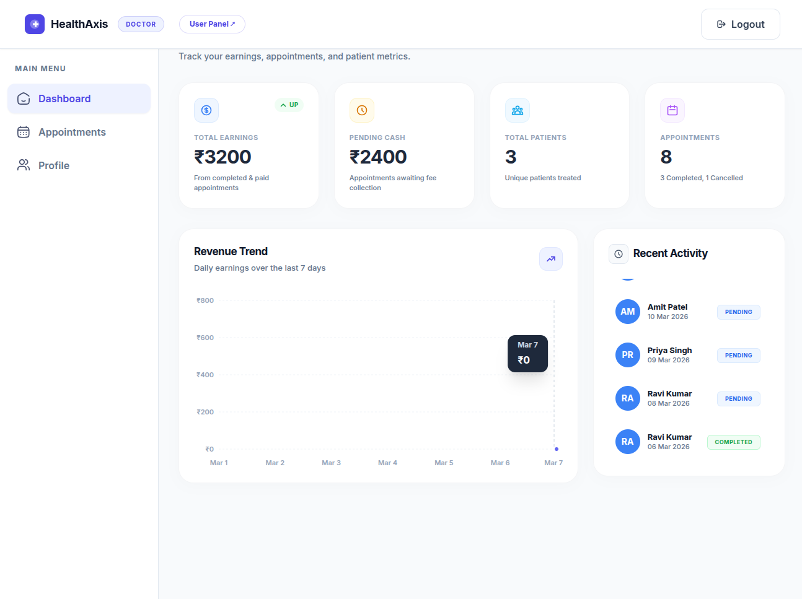
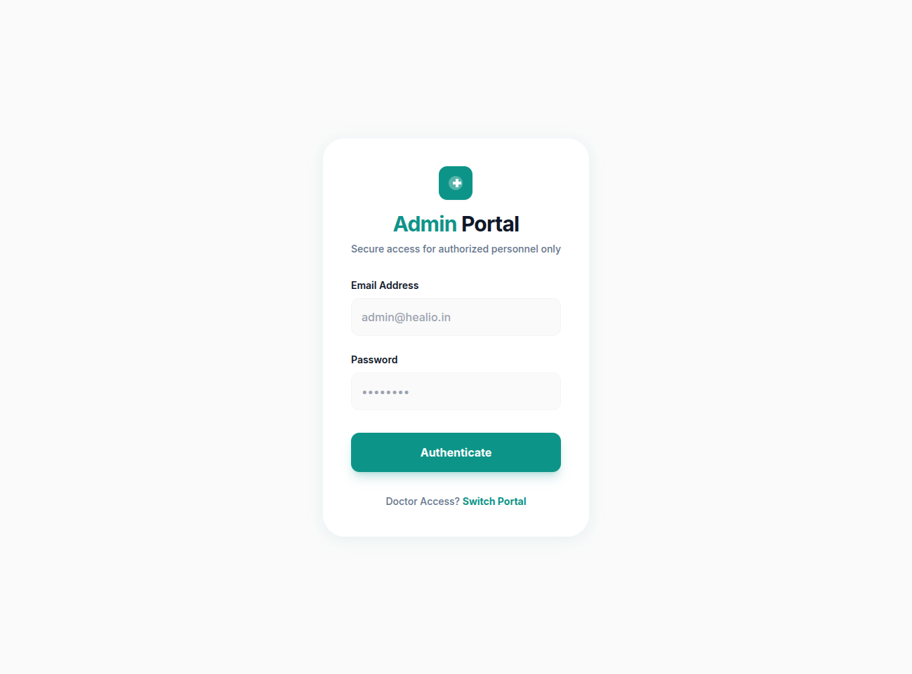

<div align="center">


# 🏥 HealthAxis

### *Your Complete Healthcare Ecosystem — Patients, Doctors & Admins, United.*

[](https://health-axis-five.vercel.app)
[](https://github.com/KartikeyaNainkhwal/HealthAxis)


</div>

---

## 📋 Table of Contents

- [Overview](#-overview)
- [Live Demo](#-live-demo)
- [Screenshots](#-screenshots)
- [Features](#-features)
- [Tech Stack](#-tech-stack)
- [Project Structure](#-project-structure)
- [Getting Started](#-getting-started)
- [Environment Variables](#-environment-variables)
- [Contributing](#-contributing)

---

## 🌟 Overview

**HealthAxis** is a full-stack, production-ready healthcare management platform that seamlessly connects **patients**, **doctors**, and **administrators** in one unified ecosystem.

Whether you're booking a doctor's appointment, managing a medical practice, or overseeing an entire clinic's operations — HealthAxis handles it all with a clean, modern UI and a powerful backend.

> 💡 Built and deployed end-to-end by [KartikeyaNainkhwal](https://github.com/KartikeyaNainkhwal) — currently live across **3 production deployments**.

---

## 🌐 Live Demo

| Deployment | URL | Status |
|---|---|---|
| 🟢 Primary | [health-axis-five.vercel.app](https://health-axis-five.vercel.app) | Live |
| 🟢 Mirror 1 | health-axis-kpth.vercel.app | Live |
| 🟢 Mirror 2 | health-axis-1rmk.vercel.app | Live |

---

## 📸 Screenshots

### 🏠 Patient-Facing Pages

<table>
  <tr>
    <td align="center"><strong>🏠 Home / About</strong></td>
    <td align="center"><strong>👨‍⚕️ Browse Doctors</strong></td>
  </tr>
  <tr>
    <td></td>
    <td></td>
  </tr>
  <tr>
    <td align="center"><strong>📅 Book Appointment</strong></td>
    <td align="center"><strong>📬 Contact Us</strong></td>
  </tr>
  <tr>
    <td></td>
    <td></td>
  </tr>
</table>

---

### 👨‍⚕️ Doctor Portal

<table>
  <tr>
    <td align="center"><strong>📊 Doctor Dashboard</strong></td>
    <td align="center"><strong>📋 My Appointments</strong></td>
  </tr>
  <tr>
    <td></td>
    <td></td>
  </tr>
  <tr>
    <td align="center" colspan="2"><strong>👤 Doctor Profile</strong></td>
  </tr>
  <tr>
    <td colspan="2" align="center"></td>
  </tr>
</table>

---

### 🛡️ Admin Panel

<table>
  <tr>
    <td align="center"><strong>🔐 Admin Login</strong></td>
    <td align="center"><strong>📊 Admin Dashboard</strong></td>
  </tr>
  <tr>
    <td></td>
    <td></td>
  </tr>
  <tr>
    <td align="center"><strong>➕ Add New Doctor</strong></td>
    <td align="center"><strong>📋 Doctors List</strong></td>
  </tr>
  <tr>
    <td></td>
    <td></td>
  </tr>
  <tr>
    <td align="center" colspan="2"><strong>🗓️ All Appointments</strong></td>
  </tr>
  <tr>
    <td colspan="2" align="center"></td>
  </tr>
</table>

---

## ✨ Features

### 👤 For Patients
- 🔍 **Browse & Search Doctors** — Filter by specialty, availability, and more
- 📅 **Online Appointment Booking** — Real-time slot selection and confirmation
- 🏠 **About & Contact Pages** — Informative, clean UI for trust-building
- 📱 **Fully Responsive** — Works seamlessly on mobile, tablet, and desktop

### 👨‍⚕️ For Doctors
- 📊 **Personal Dashboard** — Overview of today's schedule and stats
- 📋 **Appointment Management** — View, accept, or cancel patient appointments
- 👤 **Profile Management** — Update specialization, fees, availability, and bio

### 🛡️ For Admins
- 🔐 **Secure Admin Login** — Protected admin-only entry point
- 📊 **Admin Dashboard** — Bird's-eye view of platform activity
- ➕ **Add / Manage Doctors** — Onboard new doctors with full profile setup
- 📋 **Doctors Directory** — Full list with edit/delete capabilities
- 🗓️ **Appointments Overview** — Monitor all appointments across all doctors

---

## 🛠️ Tech Stack

| Layer | Technology |
|---|---|
| **Frontend** | React.js, Tailwind CSS |
| **Backend** | Node.js, Express.js |
| **Database** | MongoDB |
| **Auth** | JWT (JSON Web Tokens) |
| **File Uploads** | Cloudinary |
| **Deployment** | Vercel (Frontend) |
| **Version Control** | Git & GitHub |

---

## 📁 Project Structure

```
HealthAxis/
│
├── 📁 frontend/          # React.js Patient-facing app
│   ├── src/
│   │   ├── pages/        # Home, Doctors, Booking, Contact, About
│   │   ├── components/   # Navbar, Footer, DoctorCard, etc.
│   │   └── context/      # Global state (AppContext)
│
├── 📁 admin/             # React.js Admin & Doctor portal
│   ├── src/
│   │   ├── pages/        # Dashboard, DoctorsList, AddDoctor, Appointments
│   │   └── components/   # Sidebar, Navbar, etc.
│
├── 📁 backend/           # Node.js + Express REST API
│   ├── routes/           # Auth, Doctor, Admin, Appointment routes
│   ├── models/           # Mongoose schemas
│   ├── controllers/      # Business logic
│   └── middleware/       # Auth guards, file upload
│
├── .gitignore
└── README.md
```

---

## 🚀 Getting Started

### Prerequisites

- Node.js `v18+`
- MongoDB Atlas account (or local MongoDB)
- Cloudinary account (for image uploads)

### 1. Clone the Repository

```bash
git clone https://github.com/KartikeyaNainkhwal/HealthAxis.git
cd HealthAxis
```

### 2. Setup Backend

```bash
cd backend
npm install
# Add your .env file (see Environment Variables below)
npm start
```

### 3. Setup Frontend

```bash
cd frontend
npm install
npm run dev
```

### 4. Setup Admin Panel

```bash
cd admin
npm install
npm run dev
```

---

## 🔐 Environment Variables

Create a `.env` file in the `/backend` directory:

```env
MONGODB_URI=your_mongodb_connection_string
JWT_SECRET=your_jwt_secret_key
CLOUDINARY_NAME=your_cloudinary_cloud_name
CLOUDINARY_API_KEY=your_cloudinary_api_key
CLOUDINARY_SECRET_KEY=your_cloudinary_api_secret
ADMIN_EMAIL=admin@healthaxis.com
ADMIN_PASSWORD=your_admin_password
```

> ⚠️ **Never commit your `.env` file.** It's already covered in `.gitignore`.

---

## 🤝 Contributing

Contributions, issues, and feature requests are welcome!

1. Fork the repository
2. Create your feature branch: `git checkout -b feature/amazing-feature`
3. Commit your changes: `git commit -m 'Add some amazing feature'`
4. Push to branch: `git push origin feature/amazing-feature`
5. Open a Pull Request

---

## 👨‍💻 Author

<div align="center">

**Kartikeya Nainkhwal**

[](https://github.com/KartikeyaNainkhwal)

*Built with ❤️ — transforming how healthcare connects with technology.*

</div>

---

<div align="center">

⭐ **If you found this project helpful, please consider giving it a star!** ⭐

</div>
